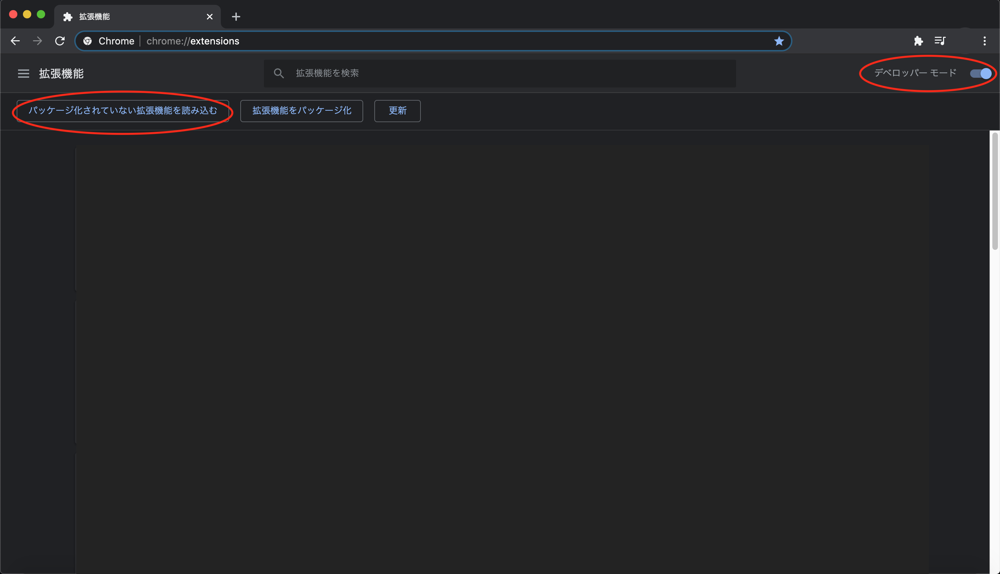
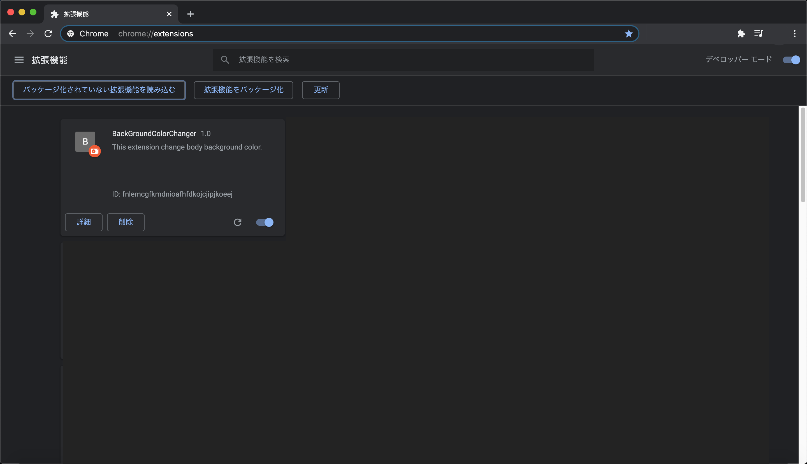
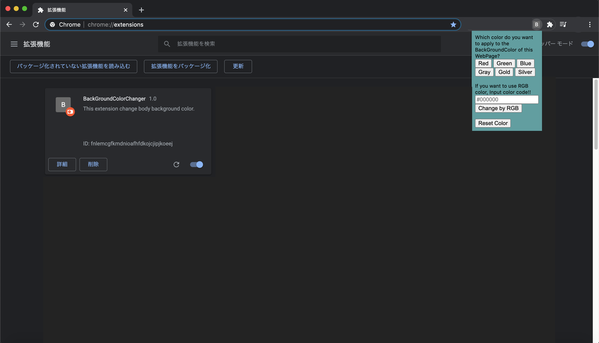
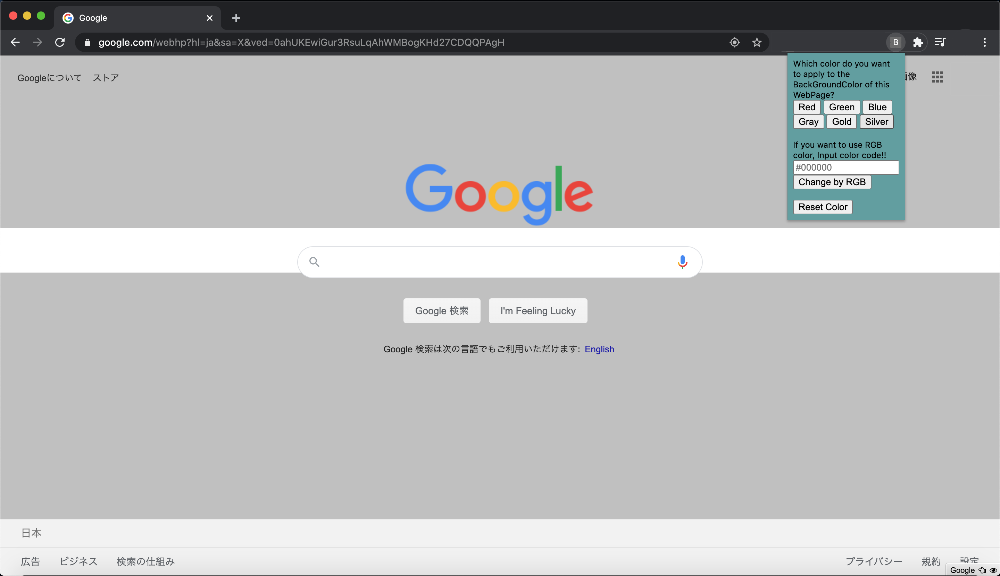

# BackGroundColorChanger

## 免責事項

この拡張機能は作者が CodeChryalis の学生の頃に学習目的で作成したものです。
この拡張機能を利用したことによる不具合、損害等が発生したとしても作成者は一切の責任を負いません。

## 使い方

### インストール方法

GoogleChrome の「設定」→「拡張機能」に移動して、「デベロッパーモード」を有効にしてください。
その後、「パッケージ化されていない拡張機能を読み込む」を開き、このリポジトリのフォルダを指定して GoogleChrome に読み込んでください。

### 使用方法

- インストール後、この拡張機能のアイコンをクリックすると小さなウインドウがポップアップで表示されます。
  
- 「Red」「Green」「Blue」「Gray」「Gold」「Siler」をそれぞれクリックすると、 
  現在開いてる Web ページの body の background-color が各色に変更されます。
- またその下テキストエリアに RGB カラーコードを入力して「Change by RGB」ボタンをクリックすると 
  現在開いてる Web ページの body の background-color が入力した RGB コードの色に変更されます。
  
  

- 背景色を変更したあとに「Reset Color」ボタンを押すと背景色が元の色に戻ります。

## 開発環境　/ 使用した技術

- ### 開発環境

  - MacBookPro 2014 Mid
  - VSCode Version : 1.46.1
  - Google Chrome Version:83.0.4103.106

- ### 使用した技術
  - HTML5
  - JavaScript ES6
  - CSS 3
